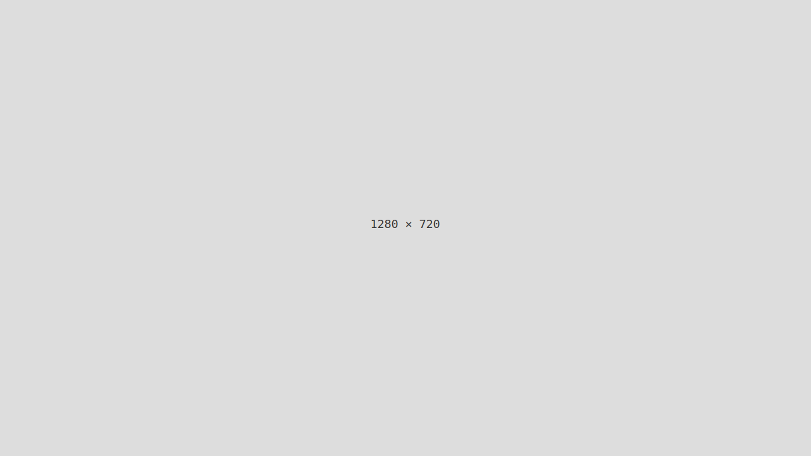

# Clarity First

- [Brief](#brief)
- [Details](#details)
- [Handoff](#handoff)
- [Recap](#recap)

## Brief

> Writing is thinking. To write well is to think clearly. That’s why it’s so hard.
>
> —[David McCullough](https://en.wikipedia.org/wiki/David_McCullough)

Author a single-page document that explores your thesis focusing on content and clarity first with the following sections:

- Thesis title
- Short description
- Mind map
- Voice and tone
- Outline
- Notes — *optional*
- Keywords
- References

### Notes

#### Keywords

Keywords are a tool to help indexers and search engines find relevant content.

Keywords should:

- Represent the content of your work
- Be specific to your field, topic, etc.

## Details

# Thesis Title

Short description; aim for a single-sentence in 120 characters or less.

<details>
  <summary>Mind Map</summary>

  
</details>

## Voice & Tone

- **Voice:** Human, confident, educated, and inspirational.
- **Tone:** Formal (academic), but friendly, enthusiastic, and conversational.

## Outline

1. Key point; aim for a single-sentence in 120 characters or less.
2. Key point; aim for a single-sentence in 120 characters or less.
3. Key point; aim for a single-sentence in 120 characters or less.
4. Key point; aim for a single-sentence in 120 characters or less.
5. Key point; aim for a single-sentence in 120 characters or less.
6. Another key point?
7. Too long, didn’t read?

### Notes

- …
- …
- …

## Keywords

- **Keyword**
  - Definition/description; aim for a single-sentence in 120 characters or less.
- **Keyword**
  - Definition/description; aim for a single-sentence in 120 characters or less.
- **Keyword**
  - Definition/description; aim for a single-sentence in 120 characters or less.
- **Keyword**
  - Definition/description; aim for a single-sentence in 120 characters or less.
- **Keyword**
  - Definition/description; aim for a single-sentence in 120 characters or less.

### References

- [APA Style Reference Examples](http://https://apastyle.apa.org/style-grammar-guidelines/references/examples)
- [Reference](http://)
- [Reference](http://)

## Handoff

Use the same repo as the previous semester and continue the order (and naming convention), depending on whether or not you have a `06-semester-takeaways` folder.

### Setup

- Create a project folder (repo) with a Markdown file and an image folder/file.
  - For example:
    - `06-clarity-first`
      - `thesis-outline.md`
      -  `img`
          - `thesis-mind-map.png`

### Format

- `thesis-outline.md`

```
# Thesis Title

Short description; aim for a single-sentence in 120 characters or less.

<!-- Note the inclusion of an empty line break after the summary element for formatting. -->

<details>
  <summary>Mind Map</summary>

  
</details>

### Voice & Tone

- **Voice:** Human, confident, educated, and inspirational.
- **Tone:** Formal (academic), but friendly, enthusiastic, and conversational.

## Outline

1. Key point; aim for a single-sentence in 120 characters or less.
2. Key point; aim for a single-sentence in 120 characters or less.
3. Key point; aim for a single-sentence in 120 characters or less.
4. Key point; aim for a single-sentence in 120 characters or less.
5. Key point; aim for a single-sentence in 120 characters or less.
6. Another key point?
7. Too long, didn’t read?

### Notes

- …
- …
- …

## Keywords

- **Keyword**
  - Definition/description; aim for a single-sentence in 120 characters or less.
- **Keyword**
  - Definition/description; aim for a single-sentence in 120 characters or less.
- **Keyword**
  - Definition/description; aim for a single-sentence in 120 characters or less.
- **Keyword**
  - Definition/description; aim for a single-sentence in 120 characters or less.
- **Keyword**
  - Definition/description; aim for a single-sentence in 120 characters or less.

### References

- [APA Style Reference Examples](http://https://apastyle.apa.org/style-grammar-guidelines/references/examples)
- [Reference](http://)
- [Reference](http://)

```

## Recap

- [What Voice and Tone Sounds Like in Practice: Inside the Buffer Content Style Guide](https://buffer.com/resources/style-guide/)
- [Voice, Tone & Content Guides](https://voiceandtoneguides.webflow.io)
